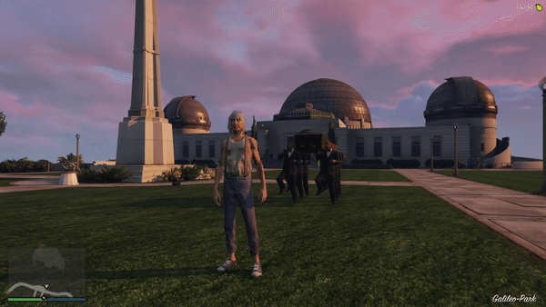

# CoffinDanceClient

This is the source Code only!
Coffin Dance Meme for FiveM GTAV in C#

Edit this Script if you want to! 

Edit also the spawnmanager.lua 
Edit this line:
if (diedAt and (math.abs(GetTimeDifference(GetGameTimer(), diedAt)) > ***PUT 13000*** in here)) or respawnForced then

InteractSound is needed!
Download and Support the Creator!

https://github.com/plunkettscott/interact-sound
Read the setup 
Put CoffinDance.ogg to interact-sound/client/html/sounds
register in Lua file from interact-sound!

Restart Server

